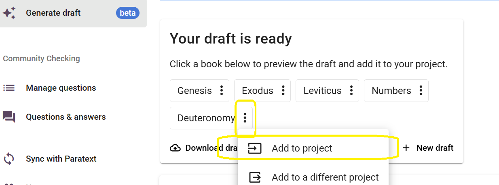
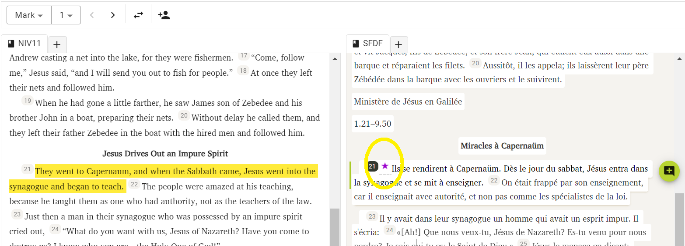
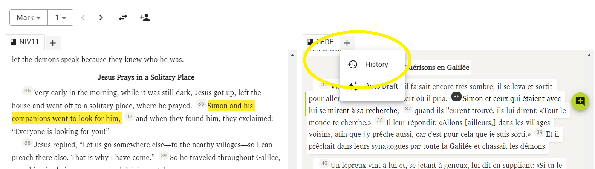

import ReactPlayer from "react-player";

# Terapkan dan Sunting Konsep{#2a0f75e3f955442e9b4f4b375f8cc58f}

<ReactPlayer controls url="https://youtu.be/S4yvGDlcZ9o" />

# Cara Mengajukan Konsep {#1430d745ac9e80878a51d2b8e2be7d05}

Setelah konsep dibuat, konsep tersebut siap untuk ditinjau dan disunting oleh penerjemah dan harus melalui langkah-langkah penerjemahan selanjutnya.

Untuk mulai menyunting, konsep harus terlebih dulu ditambahkan ke proyek Anda. Ada 3 opsi untuk melakukan ini:

### **1) Pasal demi pasal** {#1430d745ac9e80a29085eecf41dc2997}

Klik nama kitab dari konsep yang telah dibuat. Ini akan membawa Anda ke antarmuka "Sunting dan Tinjau". Gambar di bawah ini menunjukkan konsep Kitab Ulangan.

Di sini Anda akan melihat konsep pasal pertama yang tersedia di satu sisi. Di sisi lain, Anda akan melihat proyek Anda, yang seharusnya kosong dan tidak memiliki data di dalamnya untuk pasal yang dipilih. Untuk menambahkan konsep ke proyek Anda, klik "Tambahkan ke Proyek." Ini hanya akan menambahkan pasal saat ini ke proyek Anda dan Anda dapat mulai meninjau dan menyuntingnya.

### 2. Tambahkan seluruh kitab {#1430d745ac9e803183c8d916bc54de64}

Setelah konsep Anda dibuat, klik menu 3-titik di samping nama kitab yang ingin Anda tambahkan ke proyek Anda. Kemudian, klik "Tambahkan ke proyek" untuk menambahkan seluruh kitab ke proyek Anda.

### 3. Unduh Konsep dan tambahkan melalui Paratext {#1430d745ac9e80cdb498cad97099687e}

Klik "Unduh Konsep" yang akan mengunduh konsep dalam file .usfm. File ini kemudian dapat ditambahkan ke proyek Anda melalui Paratext. Setelah ditambahkan melalui Paratext, pastikan untuk menjalankan Kirim/Terima di Paratext dan kemudian sinkronisasi di Scripture Forge untuk merefleksikannya dalam proyek Anda di Scripture Forge.

# **Cara Menyunting Konsep** {#1430d745ac9e80cb8debce126560e7b5}

Hal ini dapat dilakukan di Scripture Forge dengan mengklik "Sunting dan Tinjau" yang akan membawa Anda ke layar yang ditunjukkan di bawah ini. Gambar di bawah ini menunjukkan kitab Markus.

Antarmuka akan memberi Anda dua bagian; satu bagian akan menampilkan terjemahan referensi utama (dikenal sebagai sumber), dan bagian lainnya akan menampilkan konsep yang baru saja dibuat (dikenal sebagai target). Di sini Anda dapat meninjau konsep dan membuat perubahan jika perlu, seperti halnya di Paratext.

### **Menavigasi Konsep** {#1430d745ac9e803187c2ff37b7ee519c}

Jika Anda membuat konsep untuk lebih dari satu kitab, Anda dapat menavigasi kitab dari daftar pilihan yang tersedia di bagian kiri atas layar seperti gambar di bawah ini.

Anda juga dapat menavigasi ke pasal tertentu menggunakan daftar tarik-turun tepat di sebelahnya. Atau, Anda juga dapat menavigasi ke pasal sebelumnya atau berikutnya dengan menggunakan panah di samping menu tarik-turun.

Jika Anda ingin menukar penempatan sumber dan target (panel kiri dan kanan), Anda dapat melakukannya dengan mengeklik tombol tukar seperti yang ditunjukkan di bawah ini.

Perhatikan bahwa memilih sebuah ayat dalam konsep akan menyorot ayat Terjemahan Acuan Utama yang sesuai dengan warna kuning.

Saat Anda memilih ayat dan mulai mengerjakannya, terjemahan referensi utama yang sesuai akan menavigasi secara otomatis dan akan menampilkan ayat yang sama dalam bahasa sumber, sehingga lebih mudah untuk melacak dan mengikuti konsep.

### **Menambahkan Komentar** {#1430d745ac9e8038aee0f2290df4172b}

Scripture Forge memungkinkan pengguna untuk menambahkan komentar tambahan saat mereka mengerjakan konsep.

Hal ini dapat dilakukan dengan memilih ayat di mana komentar perlu ditambahkan dan kemudian mengklik tombol "Tambahkan Komentar".

Setelah komentar ditambahkan, komentar tersebut akan ditandai dengan sebuah bintang seperti yang ditunjukkan di bawah ini. Untuk memperbarui atau menyunting komentar, cukup klik bintang dan Anda akan diminta untuk membuat perubahan yang diinginkan.

Ketika konsep diterapkan ke proyek Paratext Anda, komentar akan diekspor ke proyek Paratext Anda sebagai catatan.

### **Menampilkan Riwayat** {#1430d745ac9e809d90bbf0371c2d6c6d}

Scripture Forge menyimpan riwayat konsep setiap kali sinkronisasi dijalankan. Jika Anda perlu kembali ke versi konsep yang lebih lama, Anda dapat melakukannya dengan memeriksa riwayatnya.

Untuk melakukannya, klik tombol Tab Baru seperti yang ditunjukkan di bawah ini dan pilih "Riwayat."

Sekarang, dengan menggunakan daftar tarik-turun, pilih tanggal untuk membuka versi konsep yang diinginkan.

**Harap diperhatikan bahwa ketika konsep baru dibuat, konsep lama yang belum disimpan akan hilang. Ingatlah untuk mengunduh konsep atau menerapkannya ke proyek Paratext Anda dan jalankan sinkronisasi sebelum membuat konsep baru.**

