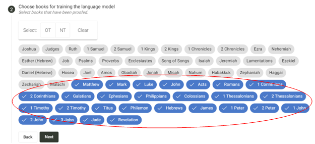

import ReactPlayer from "react-player";

<ReactPlayer controls url="https://youtu.be/binHoeAGGvU" />

Setelah Anda mendaftar untuk Pembuatan Konsep dan mengkonfigurasi pengaturan yang diperlukan, Anda dapat mengakses Scripture Forge AI Drafting dengan mengeklik tombol "Membuat Konsep" di menu utama. Anda sekarang akan memiliki akses ke tombol "Buat Konsep Baru".

Setelah Anda mengkliknya, Anda akan dibawa ke **Proses 2 Langkah** untuk membuat konsep Anda.

- **Langkah 1:** Langkah pertama untuk membuat konsep adalah memilih kitab yang ingin Anda terjemahkan. Hanya kitab-kitab yang telah ditambahkan di proyek Paratext Anda yang akan ditampilkan di sini. Kami menyarankan untuk memilih hingga 5 kitab untuk diterjemahkan sekaligus.

- **Langkah 2:** Selanjutnya, Anda akan memilihkitab-kitab yang akan digunakan untuk melatih model bahasa. Kitab-kitab ini harus diperiksa dengan baik tetapi tidak perlu diperiksa oleh konsultan. Semakin banyak kitab, semakin baik hasil penyusunannya. Jika Anda telah memilih kitab untuk diterjemahkan pada langkah 1, Anda tidak dapat memilihnya untuk melatih model pada langkah ini

- Langkah 3 (opsional): Selanjutnya, Anda juga dapat mengunggah file tambahan apa pun untuk melatih model bahasa. Ini harus dalam format .csv. Langkah ini bersifat opsional.

Setelah Anda menyelesaikan langkah-langkah ini, Anda akan melihat tombol "Membuat Konsep" yang tersedia. Setelah Anda mengkliknya, berikan waktu kepada Scripture Forge untuk membuat konsep. Ini mungkin memakan waktu sekitar 3 jam atau lebih, tergantung pada seberapa sibuk server kami.

Setelah Konsep siap, Anda akan melihat notifikasi seperti yang ditunjukkan pada gambar di bawah ini.

