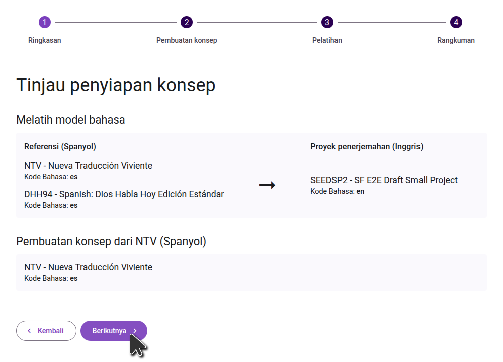
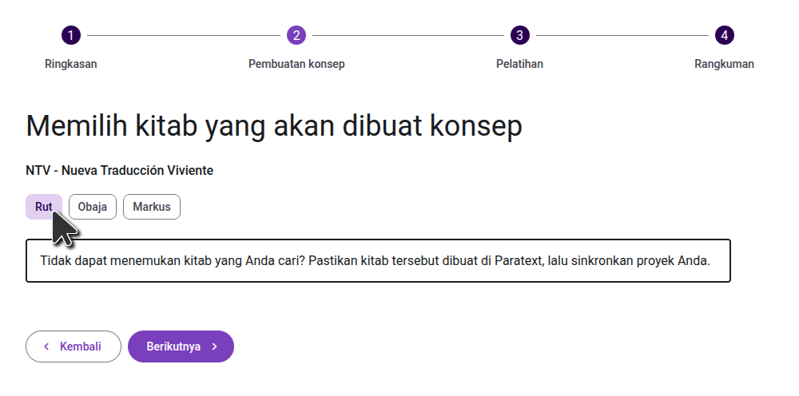
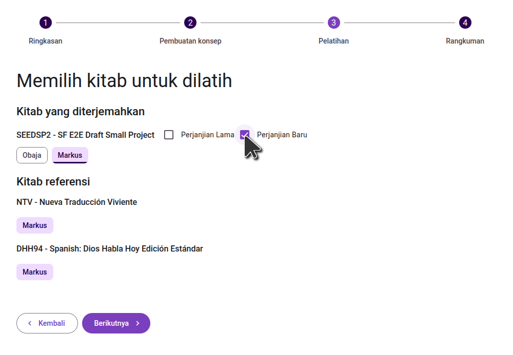
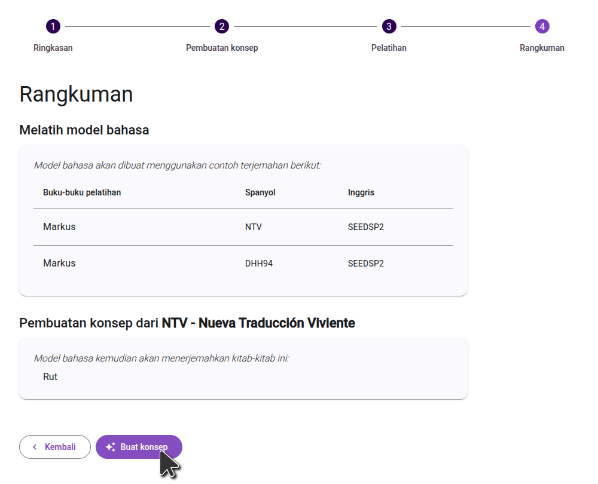

import ReactPlayer from "react-player";

<ReactPlayer controls url="https://youtu.be/binHoeAGGvU" />

## Generating a draft

Once your project has been activated and sources have been configured, click the "Generate draft" button to get started:

### Confirm the project configuration

On the first screen, review the configured sources and language codes and verify that they are correct. Then go to the next step.

:::note

If you use a separate Paratext project to store AI-generated drafts, double check that your main working translation project is listed in the **Target language data** section. Drafts must be generated from your main project so that model can learn from your completed translation work.

:::

### Select the books to draft

On the second step, select the books you want translated. If the book you want to draft does not exist in your Paratext project, you will need to create the book in Paratext first. In general we suggest drafting one book at a time, though if you are drafting smaller books, you may want to draft several at a time.

### Select the books to train the language model

On the next step, select the books to use to train the language model, both in your main project, and in the reference projects. **Choose all the books in your project that have been adequately reviewed. While they don't need to be consultant-checked, they should be accurate translations of the source book.**

### Confirm your selections

On the final step, review the books you selected to train the model, and the books you selected to draft. If you need to make any changes, you can go to the previous steps. Once you are happy with your selections, click the "Generate Draft" button to start the process.

