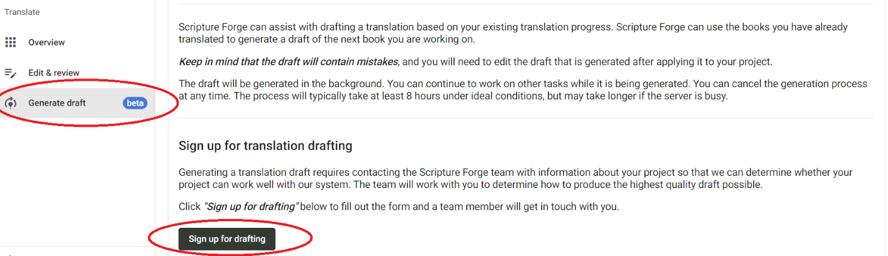

## **Mendaftar untuk Pembuatan Konsep Otomatis** {#c01e77600a3b440ead3f1b816837d614}

Untuk mengakses Scripture Forge Pembuatan Konsep Otomatis, Anda perlu mengklik tombol "Pembuatan Konsep" di menu utama. Jika ini adalah pertama kalinya Anda membuat konsep dalam proyek Anda, Anda akan diminta untuk mendaftar ke Pembuatan Konsep Terjemahan dan mengisi formulir Pembuatan Konsep Terjemahan. Anda akan melihat tombol "Mendaftar untuk Pembuatan Konsep" seperti yang ditunjukkan pada gambar di bawah ini.

Setelah Anda mengisi formulir, mohon tunggu beberapa hari agar tim onboarding Scripture Forge dapat memeriksanya dan menyelidiki pengaturan terbaik untuk proyek Anda. Setelah ini selesai, tim akan menghubungi Anda dengan instruksi lebih lanjut untuk memandu Anda dalam proses pembuatan konsep.

### **Memilih Referensi Terjemahan Utama** {#26e1244e99c0459bad277d7cff4417b8}

Untuk memilih atau mengubah Referensi Terjemahan Utama Anda, buka jendela "Pengaturan". Di sini, di bawah sub-bagian Terjemahkan, Anda akan menemukan menu tarik-turun yang akan menampilkan daftar sumber. Anda dapat mengklik di sini untuk memilih atau mengubah referensi terjemahan untuk proyek Anda.

Hal ini akan memengaruhi keseluruhan proyek dan siapa pun yang memiliki akses ke Scripture Forge.

**Anda tidak dapat menggunakan Pembuatan Konsep Otomatis tanpa memilih Referensi Terjemahan Utama.**_

Anda juga memiliki opsi untuk memilih kotak centang "Aktifkan Saran Terjemahan" tepat di bawah menu tarik-turun ini. Kotak ini memungkinkan saran untuk semua pengguna proyek. Harap diperhatikan, bahwa ini terpisah dari Pembuatan Konsep Otomatis.

**Kami sarankan untuk menonaktifkan Saran Terjemahan jika Anda berencana menggunakan Pembuatan Konsep Otomatis.**_

## **Pengaturan Pembuatan Konsep Terjemahan** {#4e17f4ac70274b9d8d615ad3d2679a82}

Setelah tim pengembang Scripture Forge memberi tahu Anda bahwa proyek Anda telah siap untuk Pembuatan Konsep Otomatis, bagian ini akan muncul di bawah Pengaturan. Tim Scripture Forge akan membantu Anda dengan instruksi untuk pengaturan ini sebagai bagian dari proses orientasi.

Seperti ditunjukkan pada gambar di atas, Anda akan mendapatkan beberapa opsi yang disajikan. Anda dapat memilih untuk tidak mencentangnya jika Anda tidak ingin menggunakannya. Setelah Anda memilih kotak centang, gunakan daftar tarik-turun yang muncul untuk memilih sumber alternatif.

**1) Gunakan sumber yang berbeda untuk kotak centang Pembuatan Konsep**

- Ini akan memungkinkan Anda untuk memilih terjemahan yang akan digunakan **sebagai pengganti** Referensi Utama Terjemahan untuk menghasilkan konsep.
- Terjemahan alternatif yang dipilih di sini haruslah **bahasa yang sama** dengan Referensi Terjemahan Utama.
- Terjemahan ini akan mempengaruhi gaya serta konten leksikal dan eksegetis dari konsep tersebut.

**2) Gunakan sumber yang berbeda untuk kotak centang Pelatihan**

- Ini akan memungkinkan Anda untuk memilih terjemahan yang akan digunakan **sebagai pengganti** Referensi Utama Terjemahan untuk melatih bahasa.
- Terjemahan alternatif yang dipilih di sini haruslah **bahasa yang sama** dengan Referensi Terjemahan Utama.
- Ini adalah konfigurasi teknis yang hanya boleh diatur jika diinstruksikan oleh tim Scripture Forge.

**3) Kotak centang judul pra-penerjemahan dan materi non-ayat** - Kami sarankan Anda membiarkan kotak ini tidak dicentang. Judul-judul perikop akan tetap diterjemahkan.

**4) Kotak centang Izinkan data pelatihan tambahan** - Memilih kotak centang ini akan memungkinkan Anda untuk mengunggah dokumen lebih lanjut yang dapat digunakan untuk melatih model bahasa. File-file ini harus berisi kalimat paralel dalam bahasa sumber dan bahasa target yang sama dengan Referensi Terjemahan Utama (sumber) dan proyek target. Harap diperhatikan bahwa Anda **hanya dapat mengunggah file .csv** untuk tujuan ini.

