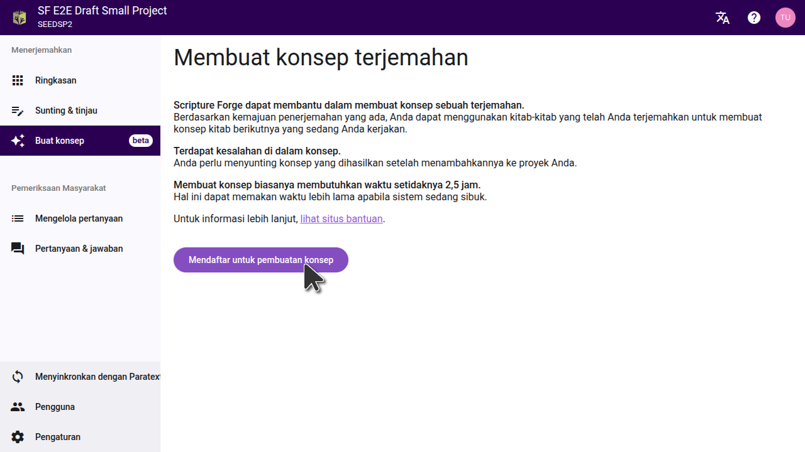
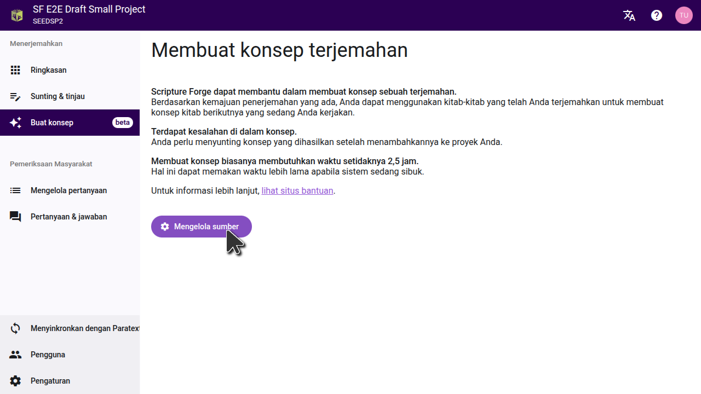
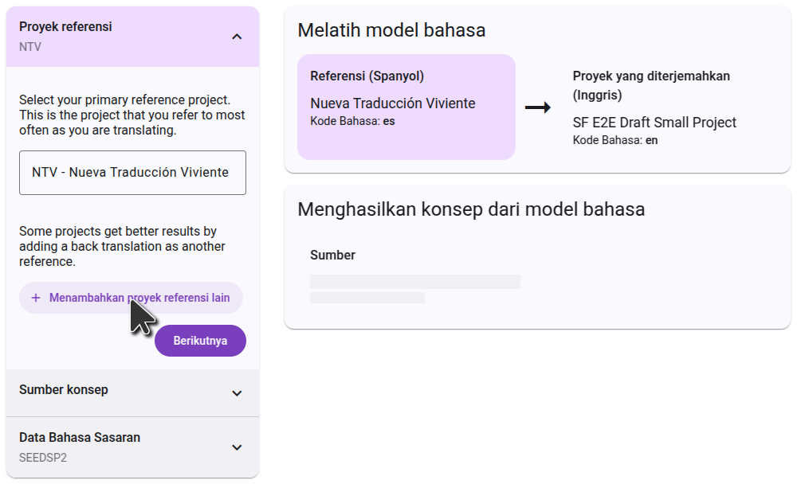
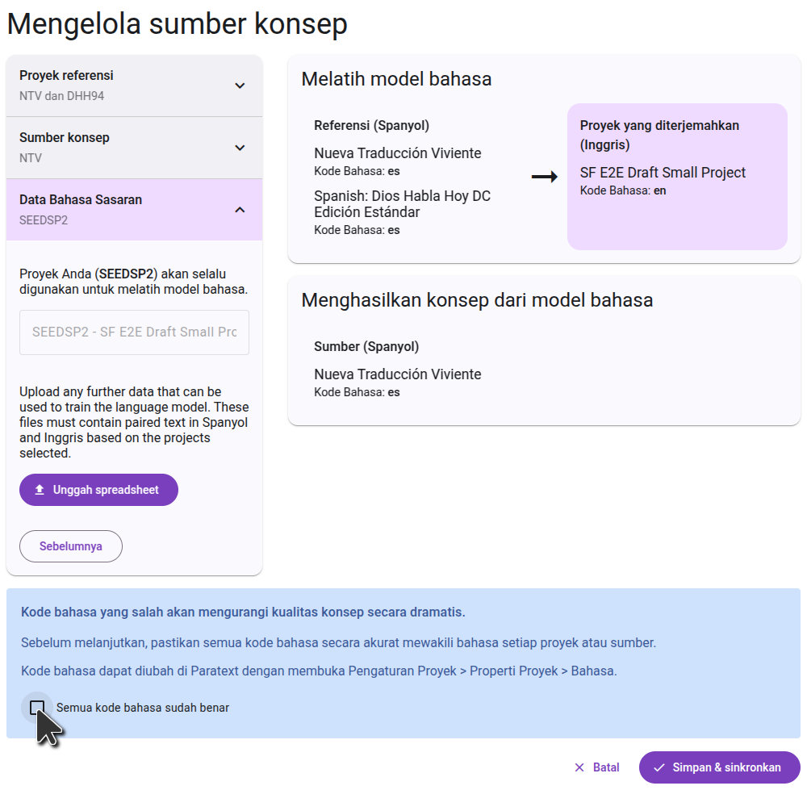

## Sign up to generate drafts {#c01e77600a3b440ead3f1b816837d614}

To generate drafts in Scripture Forge, click on the "Generate Draft" button in the main menu. Then click the "Sign up for Drafting" button, and fill out the form that opens, to get access for your project. Back translation projects are enabled by default and do not need to fill out the form.

After you fill out the form, the Scripture Forge onboarding team will review your request and work to find the best settings for your project. You will be provided with one or more drafts to review. If you decide that generating drafts is right for your project, the team will enable drafting on your project and guide you through the process of selecting the settings that were found to be best.

## Configuring the draft {#26e1244e99c0459bad277d7cff4417b8}

Once your project has had drafting enabled, the "Sign up for drafting" button will be replaced with a "Configure sources" button. Click this button to select the projects that will be used as the source for your draft.

### Choosing the source project

The first step is to select the project you want the draft to be translated from. Usually this will be in a language of wider communication. This can be a Paratext project, or a Digital Bible Library resource. Start typing the name of the project (or the project short name), and the list will filter to show only the projects that match. Click on the project you want to use as a source, then go to the next step.

### Choosing the reference projects

The reference project is used for training the language model. Often you will use the same project as the source project, but in some cases you can get better results by using a different project. Some projects may select a second reference project. One common use case is to select your back translation as a second reference project.

Every project is different, so follow the instructions you received from the onboarding team.

### Confirming the languages

The final step shows the target language data. This will always include your project itself, which is already selected and cannot be removed. Currently it's not possible to add additional training data at this step.

On the right side, you will see a diagram of how the projects you selected will be used to generate the draft. In the first step, the language model will learn from comparing the reference projects to the translated project. In the second step, it will use that knowledge to translate the source project.

