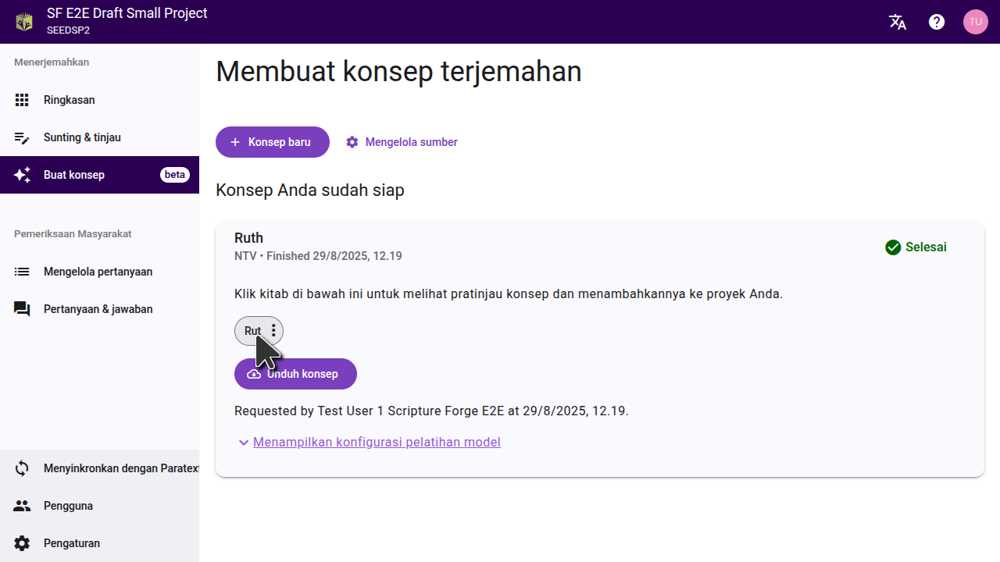
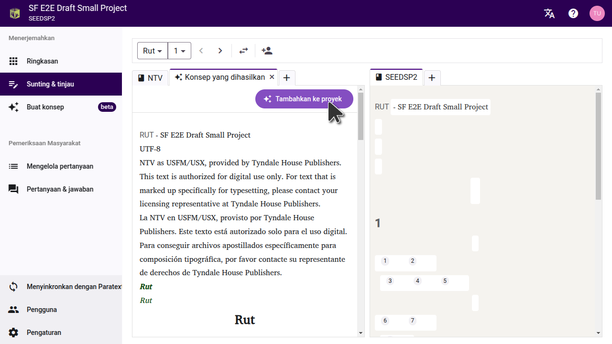
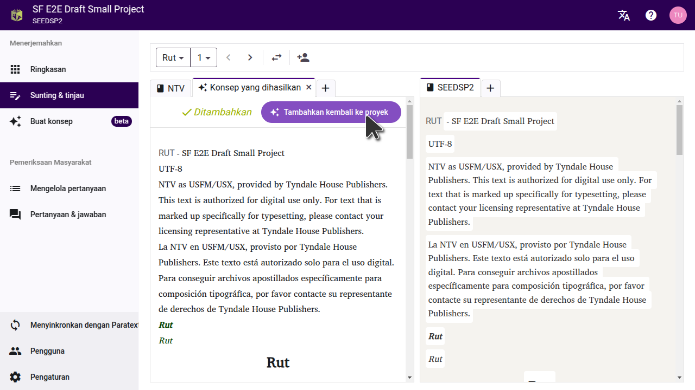
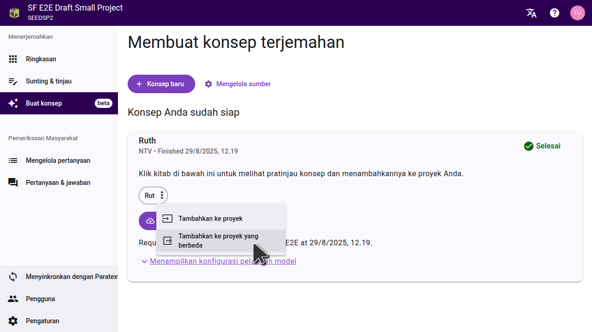
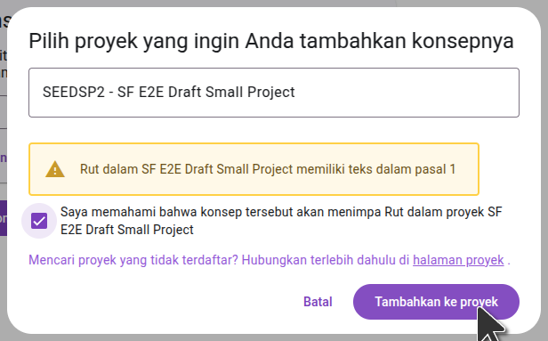
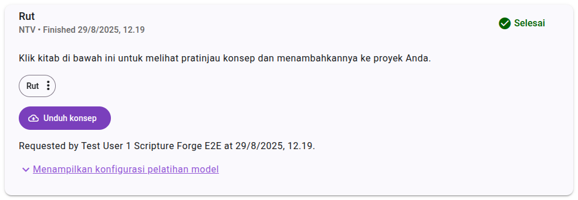

When your draft is finished, Scripture Forge will indicate that it's ready and list the books that were drafted. Generated drafts are **not** automatically imported to your project. You can preview or import drafts from the **Generate draft** page.

- To import **individual chapters**, preview the chapter and choose "Add to project." Individual chapters can only be added to the current project.
- To import a **full book**, open the three-dot menu next to the book name. You can choose to import the book into the current project or a different project.

## Previewing a draft

Click on a book title to view the draft. The draft will open in a new tab on the editor page.

:::tip

To compare the draft to the text it was translated from, set a source on the settings page. This will allow you to see a source and the resulting draft side-by-side.

If you drafted a book the team has already finished translating, you can move the draft tab to the other side of the page, and compare it with the team's translation.

:::

## Importing a single chapter

When previewing the draft, you can import the draft of the current chapter into the project by clicking "Add to project". You can go to each chapter in the book and preview and import each chapter one at a time. This will add the chapter to the current project; not to a different project.

## Importing an entire book

If you want to import an entire book, you can do this from the "Generate draft" page. Click the three-dot menu beside the book, and then select the option to import it to the current project, or to a different project.

In the dialog that opens, select the project you want the draft to be imported to. If the project hasn't been connected in Scripture Forge yet, you will need to connect it first. **Important:** Importing the draft will replace any existing content in the project for that book.

:::note

The project must already have the book you are importing. Make sure you have already created the book in Paratext and synced it to Scripture Forge.

:::

Once you've imported the draft to a project, sync the project in Scripture Forge and then do a send/receive in Paratext to see the changes.

## Exporting USFM files

If you prefer not to import the draft directly to your project, you can also download the draft as USFM files. On the "Generate draft" page, click "Download draft", and extract the files on your computer. You can then import these files into a project in Paratext.

## Viewing drafts in Paratext 10 Studio

Paratext 10 Studio includes a Scripture Forge extension. You can view drafts without importing them:

1. Open the Scripture Forge extension.
2. Masuk ke Scripture Forge.
3. Select your project to view the draft.

