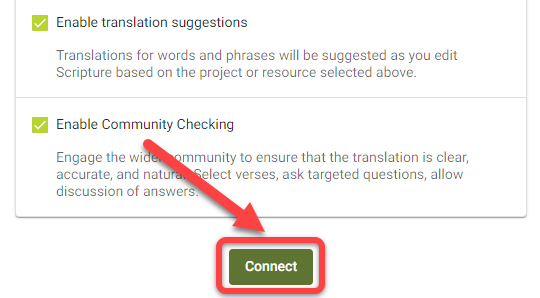

import ReactPlayer from "react-player";

## Pendahuluan {#6222bdf3db3a44b4bf01a9cc6ffdaa80}

:::tip

Paratext projects only need to be connected once within Scripture Forge.

:::

Setelah proyek Paratext terhubung ke Scripture Forge, setiap pengguna yang menjadi anggota proyek di Paratext (di bawah Izin Pengguna) akan dapat membuka proyek di Scripture Forge.

To be able to open a project in Scripture Forge, a user just needs to [log in to Scripture Forge with their Paratext account information](/log-in).

<ReactPlayer controls url="https://youtu.be/exEJxc19Zm4" />

## Cara Menghubungkan proyek Paratext ke Scripture Forge {#a71dfc268ebb43a0b19c0ab7018f92b4}

1. Jika Anda belum **pernah menghubungkan** proyek ke Scripture Forge:
    1. Klik tombol Hubungkan proyek:

        

2. Jika Anda telah menghubungkan sebuah proyek ke Scripture Forge, ikuti petunjuk ini untuk menghubungkan proyek tambahan:

    Untuk melihat daftar proyek yang dapat Anda akses di Paratext, klik ikon Scripture Forge di sebelah kiri atas layar.

Atau, Anda juga dapat mengklik ikon profil Anda di bagian kanan atas layar dan dari menu tarik-turun, klik "Proyek Saya."

Dari daftar yang ditampilkan, Anda akan dapat membuka proyek jika sudah terhubung. Anda juga dapat bergabung dengan sebuah proyek atau klik "Hubungkan" untuk menghubungkan sebuah proyek untuk pertama kalinya di Scripture Forge.

Setelah mengklik "Hubungkan", Anda akan diminta untuk memilih Sumber Proyek. Dari daftar drop-down yang tersedia, pilih sumber yang ingin Anda gunakan untuk proyek Anda.

Opsional: Mengaktifkan saran terjemahan (#1 di bawah)

Opsional: Aktifkan Pemeriksaan Masyarakat (#2 di atas)

When you are ready, click Connect:

Tunggu sampai Scripture Forge menghubungkan proyek Paratext:

Scripture Forge may take a while to connect your project. The green progress bar will stop moving when your project is fully connected:

Note: You may be able to work in Scripture Forge before it is fully connected.

