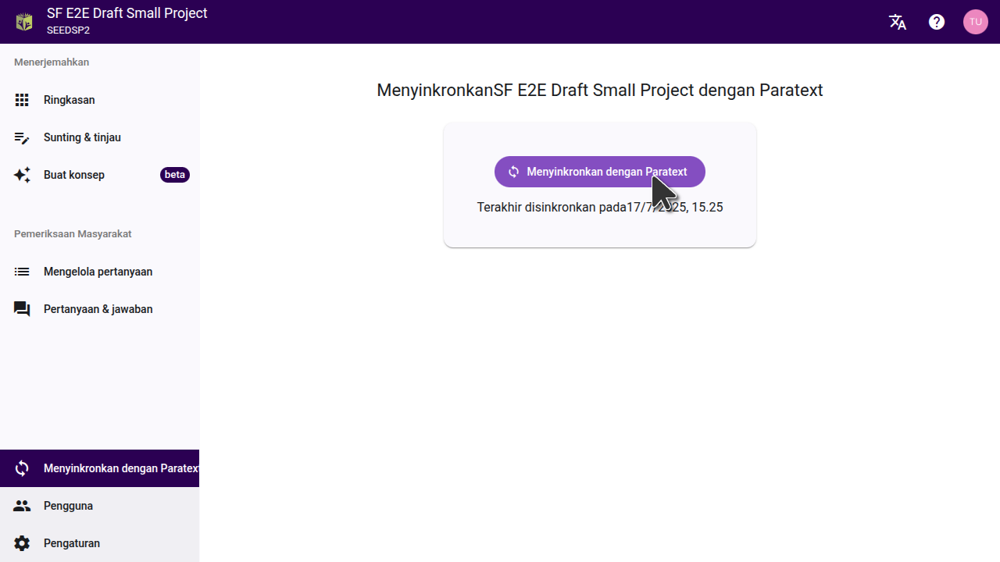

Menyinkronkan proyek Scripture Forge Anda dengan Paratext sangatlah penting karena hal ini memungkinkan perubahan yang telah Anda buat di Scripture Forge disimpan ke server Paratext dan juga menarik data terbaru dari proyek Paratext ke dalam Scripture Forge.

Ini mirip dengan fungsi Kirim/Terima di Paratext.

_Perhatikan bahwa sinkronisasi proyek di Scripture Forge berlaku untuk _**SEMUA PENGGUNA**_ _dari proyek SF. Ini juga akan diterapkan pada server Paratext seperti halnya fungsi kirim/terima._

## **Cara Menyinkronkan proyek Anda** {#d0af3ae0f98640c6a88fe4132a015be0}

Untuk menyinkronkan proyek, Anda perlu mengklik "Sinkronisasi" pada menu utama. Ini akan menampilkan tombol "Sinkronisasi" di jendela Anda. Setelah Anda mengekliknya, tunggu sampai sinkronisasi selesai dan kedua tanda panah berhenti berputar-putar, sebelum melakukan apa pun, seperti yang ditunjukkan pada gambar di bawah ini.

## **Kapan perlu melakukan Sinkronisasi proyek** {#b19f92d1a5714c4fb57b61672d95b898}

- Sinkronisasi otomatis terjadi ketika Anda pertama kali menghubungkan proyek ke Scripture Forge dari Paratext untuk pertama kalinya. Scripture Forge masih mengimpor data proyek Anda dari server Paratext ketika sedang melakukan sinkronisasi. Penting untuk menunggu sampai sinkronisasi selesai (kedua anak panah berhenti berputar-putar) sebelum mencoba melakukan apa pun.
- Setelah Anda membuat perubahan apa pun dalam proyek Paratext Anda dan mengklik "kirim/terima", penting untuk menjalankan sinkronisasi di Scripture Forge agar perubahan ini dapat diimpor ke dalam Scripture Forge. Hanya dengan menjalankan fungsi "kirim/terima" di Paratext saja tidak cukup untuk membuat perubahan yang tercermin dalam Scripture Forge.
- An automatic sync happens when you select a reference translation or generate a draft.
- Setelah Anda menambahkan konsep ke proyek Anda di Scripture Forge, ingatlah untuk menjalankan sinkronisasi untuk menyimpan data ke server Paratext. Jangan membuat konsep baru kecuali konsep pertama telah ditambahkan ke proyek Anda atau konsep tersebut tidak akan disimpan ke server Paratext dan datanya akan hilang.
- Setiap perubahan atau penyuntingan yang dilakukan pada proyek Anda di Scripture Forge perlu disinkronkan untuk menyimpannya ke server Paratext. Setelah ini selesai, Anda juga perlu menjalankan kirim/terima pada proyek Paratext lokal Anda untuk mengimpor perubahan ini.
