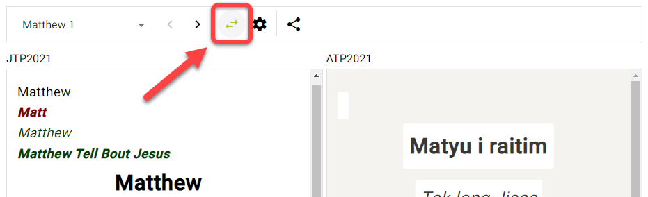
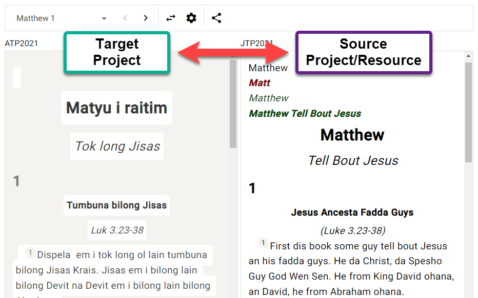
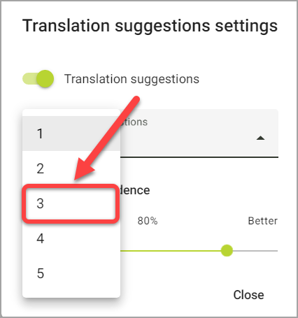
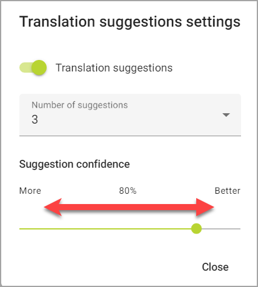

## Apa yang dimaksud dengan Saran Penerjemahan? {#5f721bd65922446f8eefb001acc89f30}

:::info

"Translation suggestions" is an older Scripture Forge feature that provides interactive suggestions to translators as they type within Scripture Forge. It works best when translating between very similar languages.

Translation drafting is a newer, more flexible, and more powerful translation tool in Scripture Forge that creates drafts for translators to review and edit.

:::

Translation suggestions allow Scripture Forge to analyze a source and target language together, and automatically suggest words/phrases to use in the translation process.

- Saran penerjemahan didasarkan pada analisis Scripture Forge terhadap ayat-ayat dalam proyek target yang telah diterjemahkan dari proyek sumber.
- Semakin banyak ayat yang Anda miliki di sumber dan target, semakin baik saran yang diberikan.
- Saran bekerja lebih baik dengan bahasa yang lebih mirip, dan tidak bekerja dengan baik dengan bahasa yang tidak berhubungan satu sama lain.
- Sebelum Anda mulai menggunakan saran terjemahan, administrator proyek Paratext harus mengaktifkan saran terjemahan untuk proyek Anda.

## Mengatur Jendela Saran Terjemahan Anda {#055dfd61aa9442e3b6c787613c8085d6}

:::note

This must be done by each user who wants to use translation suggestions.

:::

### Pilih Proyek Anda {#4de2ee23101e4a498e465465740c5a51}

:::tip

First you need to **select your project** from the navigation page, if you haven't already.

:::

1. Klik pada panel navigasi Scripture Forge:

    

2. Pilih Proyek Anda:

    

**ATAU**

1. Klik ikon menu Scripture Forge:

    

2. Klik pada menu tarik-turun proyek:

    

3. Klik pada proyek Anda:

    

### Mengatur Jendela Saran Terjemahan {#8798a078b0464f5190de5d6dd7e4d132}

1. Pada panel navigasi, klik bagian Terjemahkan:

    

2. Klik kitab yang ingin Anda kerjakan:

    

3. Teks sumber akan ditampilkan di bagian kiri, dan proyek teks target akan ditampilkan di bagian kanan:

    

    1. **Catatan:** Nama proyek/sumber yang Anda gunakan ada di sudut kiri atas setiap jendela:

        

4. Untuk beralih di antara kitab:
    1. Buka panel navigasi > bagian Terjemahan.
    2. Klik pada nama kitab:

    

5. Untuk beralih antar pasal:
    1. Klik tanda panah kanan dan kiri di bagian atas jendela:

    

6. Untuk menukar sisi sumber dan target proyek:
    1. Click the "swap source and target" button:

    

    1. Hal ini akan memindahkan proyek target ke sisi kiri, dan proyek sumber ke sisi kanan:

    

## Apa yang dimaksud dengan Segmen? {#3931f83c77104d27bfa1bcd797303914}

:::tip

Before doing translation work in Scripture Forge, you should understand what a "**segment**" is.

:::

Dalam Scripture Forge, sebuah segmen adalah bagian Alkitab yang akan diterjemahkan. Ini bisa berupa judul bagian, ayat, atau bagian dari ayat (seperti dalam puisi).

Sebagai contoh, ayat berikut ini memiliki 6 segmen (Judul, Judul Bagian, Ayat 1, dst):

Dalam perikop berikutnya, ada 8 segmen total (catatan: ayat 23 memiliki 6 segmen):

## Cara Menggunakan Saran Terjemahan {#007fd10ab17d498ea44ffb913d92663f}

Now that you understand how to navigate in Scripture Forge, it's time to learn how to use **translation suggestions**. Ingat, saran terjemahan adalah ketika Scripture Forge menganalisis pekerjaan terjemahan Anda dan secara otomatis menyarankan kata/frasa yang akan digunakan dalam proses penerjemahan.

1. Dalam proyek Anda, buka kitab dan pasal yang ingin Anda terjemahkan.
2. Klik di segmen yang ingin Anda terjemahkan.
3. Mulailah mengetik terjemahan Anda (sisi kanan):

    

    1. Catatan: Scripture Forge akan menyimpan hasil suntingan saat Anda mengetik.
4. Saat Anda mengetik, saran mungkin muncul dalam kotak di bawah tempat Anda mengetik:

    

5. Next to the suggestions is a percentage:

    

    1. Hal ini mengindikasikan seberapa yakin sistem bahwa saran ini benar. Saran dengan persentase yang lebih tinggi kemungkinan besar merupakan saran yang lebih berkualitas.
6. Jika Anda ingin menggunakan saran, klik saran tersebut atau tekan **Enter** ketika saran tersebut disorot.

    

7. Ini akan menyisipkan saran tersebut ke dalam teks:

    

8. Jika Anda tidak menyukai saran yang disisipkan ke dalam teks:
    1. Cukup hapus atau sunting kata apa pun yang perlu diubah.

        

9. Jika tidak ada saran yang cukup baik, Anda dapat mengabaikan saran tersebut dan terus menerjemahkan.

### Lanjutkan Menerjemahkan {#9e130c3ad9c048a4822e37e0d0ba0750}

:::tip

Scripture Forge will continue to learn and make better suggestions as you translate.

To adjust the _**translation suggestion settings**_ for your user, see the [steps here 🔗](/translation-suggestions).

:::

### Tombol pintas keyboard {#228a943ddd984192b78ae4ccb39c6211}

1. Ketika Scripture Forge menampilkan saran terjemahan, Anda dapat menggunakan **tombol panah atas** dan **tombol panah bawah** untuk menyorot saran yang Anda inginkan.

    

    1. Kemudian tekan **Enter** untuk menggunakan saran tersebut.
2. Anda juga dapat menekan **CTRL + &lt;a number key&gt;** untuk memasukkan sejumlah kata untuk saran yang disorot.
    1. For example, if "Capernaum and they say" was highlighted:

        

    2. Berikut ini adalah tombol pintasan yang akan disisipkan:

        | Pintasan | Kata-kata yang disisipkan    |
        | -------- | ---------------------------- |
        | Ctrl + 1 | Kapernaum                    |
        | Ctrl + 2 | Kapernaum dan                |
        | Ctrl + 3 | Kapernaum dan mereka         |
        | Ctrl + 4 | Kapernaum dan mereka berkata |

## Sesuaikan Pengaturan Saran Terjemahan - Per Pengguna {#3822d035acfd42ae888cefbd7b71fcb5}

:::note

You can configure the translation suggestion settings for your individual user.

:::

1. Pilih proyek Anda dari panel Navigasi.
2. Klik bagian Terjemahkan.
3. Klik kitab yang ingin Anda kerjakan:
    1. **Catatan:** Anda bisa memilih kitab apa pun untuk bagian ini, pengaturannya sama untuk semua kitab.
4. Klik tombol Pengaturan saran terjemahan:

    

5. Kotak dialog pengaturan saran terjemahan muncul:

    

6. **Saran terjemahan**: Ini hanya menampilkan atau menyembunyikan saran dalam **proyek saat ini** untuk **pengguna Anda**.
    1. Klik tombol Saran terjemahan untuk menampilkan atau menyembunyikan saran terjemahan saat Anda mengetik:

    

7. **Jumlah saran**: Ini mengubah jumlah saran yang akan Anda lihat pada satu waktu.
    1. Klik jumlah saran:

        

    2. Kemudian klik jumlah maksimum saran yang ingin Anda lihat sekaligus:

        

8. **Keyakinan saran:** Nilai persentase yang muncul di atas penggeser menunjukkan tingkat kepercayaan minimum dari saran yang akan ditawarkan.
    1. Klik dan seret kontrol penggeser untuk menyesuaikan tingkat keyakinan:

        

    2. **Lebih banyak** _meningkatkan_ jumlah saran dengan memasukkan _lebih banyak_ saran yang memiliki tingkat kepercayaan rendah.
    3. **Lebih baik** _mengurangi_ jumlah saran dengan menyertakan saran yang _lebih baik_ yang memiliki tingkat kepercayaan yang lebih tinggi.
9. Klik Tutup setelah Anda selesai.
