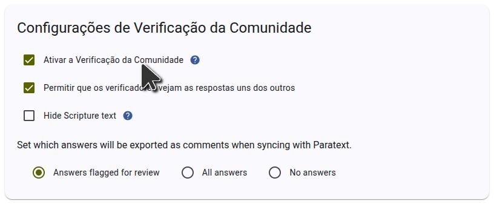

To set up community checking in Scripture Forge, [log in with Paratext](log-in). You must be an admin of the project to set up community checking.

If the project hasn't been connected to Scripture Forge yet, [connect the project](connect-paratext-project) and keep the **Enable Community Checking** checkbox ticked.

If the project has already been connected, you can enable community checking on the **Settings** page. In the **Community checking** section of the settings page, tick the **Enable Community Checking** checkbox as shown in the screenshot below.

