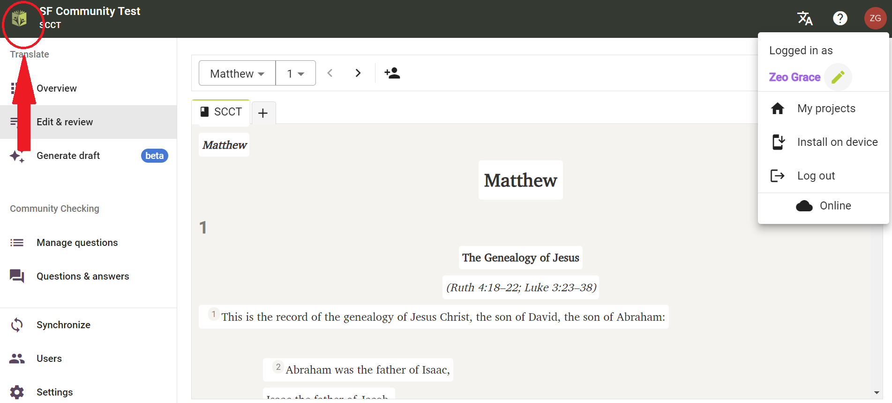
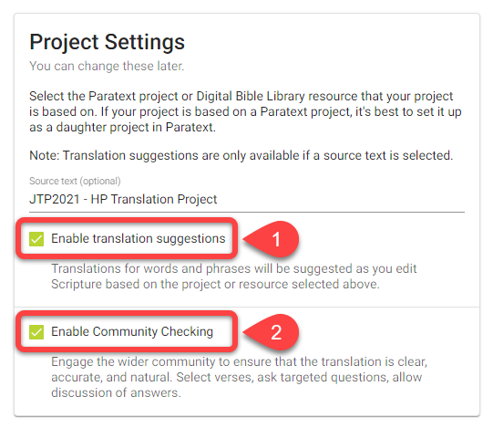
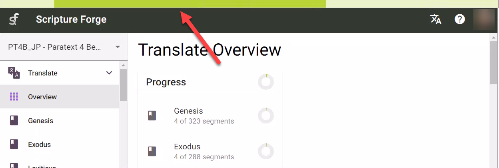

import ReactPlayer from "react-player";

## Introdução {#6222bdf3db3a44b4bf01a9cc6ffdaa80}

:::tip

Paratext projects only need to be connected once within Scripture Forge.

:::

After a Paratext project is connected to Scripture Forge, every user that is a member of the project in Paratext (under User Permissions) will be able to open the project in Scripture Forge.

To be able to open a project in Scripture Forge, a user just needs to [login to Scripture Forge with their Paratext account information](/log-in).

<ReactPlayer controls url="https://youtu.be/exEJxc19Zm4" />

## How to Connect a Paratext Project to Scripture Forge {#a71dfc268ebb43a0b19c0ab7018f92b4}

1. If you have **never connected** a project to Scripture Forge:
    1. Click the Connect project button:

        

2. If you have already connected a project to Scripture Forge, follow these instructions to connect any additional projects:

    To view the list of projects you have access to in Paratext, click on the Scripture Forge icon on the top left of the screen.

Alternatively, you can also click on your profile icon on the top right of the screen and from the drop-down menu click “My Projects.”

From the displayed list, you shall be able to Open projects if they are already connected. You can also join a project or click on “Connect” to connect a project for the first time in Scripture Forge.

After clicking on “Connect” you will be asked to select your Project Source. From the available drop-down list, select the source you wish to use for your project.

Optional: Enable translation suggestions (#1 below)

Optional: Enable Community Checking (#2 above)

When you are ready, Click Connect:

Wait for Scripture Forge to connect the Paratext project:

Scripture Forge may take a while to connect your project, the green progress bar will stop moving when your project is fully connected:

Note: You may be able to work in Scripture Forge before it is fully connected.

